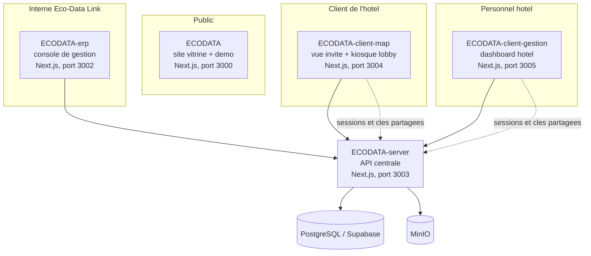

# Eco-Data Link

Depot chapeau du projet Eco-Data Link, outil scientifique de preuve d'impact biodiversite aligne sur le standard TNFD, destine aux hotels et domaines de nature et de luxe. Ce depot ne contient pas de code produit : il rassemble les liens vers les 5 depots de services (en sous-modules git) et un docker-compose pour les lancer ensemble en local.

Site en production : [ecodatalink.fr](https://ecodatalink.fr)

## Architecture



`ECODATA-client-gestion`, `ECODATA-client-map` et `ECODATA-erp` accedent aujourd'hui directement a Supabase pendant leur migration progressive vers l'API partagee de `ECODATA-server`. Les secrets `GUEST_SESSION_SECRET` et `SENSOR_API_KEY_PEPPER` doivent rester identiques sur `ECODATA-server`, `ECODATA-client-map` et `ECODATA-client-gestion`, car ces services verifient mutuellement leurs sessions et jetons.

## Services

| Depot | Role | Port local |
|---|---|---|
| [ECODATA](https://github.com/ecodata-link/ECODATA) | Site vitrine et demo 3D publique | 3000 |
| [ECODATA-erp](https://github.com/ecodata-link/ECODATA-erp) | Console de gestion de la plateforme (tickets, incidents, contrats, factures) | 3002 |
| [ECODATA-server](https://github.com/ecodata-link/ECODATA-server) | API centrale et base de donnees (telemetrie, detections, authentification) | 3003 |
| [ECODATA-client-map](https://github.com/ecodata-link/ECODATA-client-map) | Vue invite (jumeau numerique 3D) et affichage kiosque de lobby | 3004 |
| [ECODATA-client-gestion](https://github.com/ecodata-link/ECODATA-client-gestion) | Tableau de bord destine au personnel de l'hotel | 3005 |

## Demarrage

### Recuperer tous les services

```bash
git clone --recurse-submodules https://github.com/ecodata-link/ecodata-core.git
cd ecodata-core
```

Si le depot est deja clone sans les sous-modules :

```bash
git submodule update --init --recursive
```

### Variables d'environnement

Chaque service a son propre `.env.example` a la racine de `services/<nom-du-service>`. Copier chacun vers `.env.local` (ou `.env` selon le service) et renseigner les valeurs, en gardant les memes valeurs de `GUEST_SESSION_SECRET` et `SENSOR_API_KEY_PEPPER` sur `ECODATA-server`, `ECODATA-client-map` et `ECODATA-client-gestion`.

### Lancer tous les services en local

```bash
docker compose up
```

Le fichier `docker-compose.yml` demarre une base PostgreSQL locale, un stockage MinIO local, et les 5 applications Next.js. Seul le depot `ECODATA` dispose d'un Dockerfile de production (utilise pour son propre deploiement sur ecodatalink.fr) ; les 4 autres services n'ont pas de Dockerfile pour le moment, ils sont donc lances ici avec l'image Node officielle et leur script `npm run dev`, code source monte en volume.

## Depots lies

- [ECODATA](https://github.com/ecodata-link/ECODATA)
- [ECODATA-server](https://github.com/ecodata-link/ECODATA-server)
- [ECODATA-client-gestion](https://github.com/ecodata-link/ECODATA-client-gestion)
- [ECODATA-client-map](https://github.com/ecodata-link/ECODATA-client-map)
- [ECODATA-erp](https://github.com/ecodata-link/ECODATA-erp)

## Contact

Brieuc Dumortier, Data Engineer

- Email : [dumortier.contact@gmail.com](mailto:dumortier.contact@gmail.com)
- LinkedIn : [dumortier-brieuc](https://www.linkedin.com/in/dumortier-brieuc/)
- GitHub : [@BaditSad](https://github.com/BaditSad)
