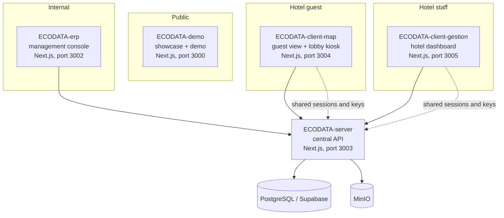

<div align="center">
  

  <h1>Eco-Data Link, Core</h1>

  <p>
    Umbrella repository for the Eco-Data Link project, a scientific tool proving biodiversity impact aligned with the TNFD standard, built for luxury nature hotels and estates. This repository holds no product code: it gathers the links to the 5 service repositories (as git submodules) and a docker-compose file to run them together locally.
  </p>

  <h4>
    <a href="https://ecodatalink.fr">Live site</a>
  </h4>
</div>

<br />

## :notebook_with_decorative_cover: Table of Contents

- [About](#star2-about)
- [Architecture](#space_invader-architecture)
- [Services](#gear-services)
- [Getting Started](#toolbox-getting-started)
  * [Clone all services](#running-clone-all-services)
  * [Environment Variables](#key-environment-variables)
  * [Run everything locally](#triangular_flag_on_post-run-everything-locally)
- [Related Repositories](#link-related-repositories)
- [Contact](#handshake-contact)

## :star2: About

Eco-Data Link is split into 5 independent applications sharing the same database and object storage. This repository is the entry point: it documents how the pieces fit together and lets you spin up the whole stack locally with a single command.

## :space_invader: Architecture



`ECODATA-client-gestion`, `ECODATA-client-map` and `ECODATA-erp` currently access Supabase directly while they are gradually migrated to the shared `ECODATA-server` API. The `GUEST_SESSION_SECRET` and `SENSOR_API_KEY_PEPPER` secrets must stay identical across `ECODATA-server`, `ECODATA-client-map` and `ECODATA-client-gestion`, since these services mutually verify each other's sessions and tokens.

## :gear: Services

| Repository | Role | Local port |
|---|---|---|
| [ECODATA-demo](https://github.com/ecodata-link/ECODATA-demo) | Public showcase site and 3D demo | 3000 |
| [ECODATA-erp](https://github.com/ecodata-link/ECODATA-erp) | Platform management console (tickets, incidents, contracts, invoices) | 3002 |
| [ECODATA-server](https://github.com/ecodata-link/ECODATA-server) | Central API and database (telemetry, detections, authentication) | 3003 |
| [ECODATA-client-map](https://github.com/ecodata-link/ECODATA-client-map) | Guest view (3D digital twin) and lobby kiosk display | 3004 |
| [ECODATA-client-gestion](https://github.com/ecodata-link/ECODATA-client-gestion) | Dashboard for hotel staff | 3005 |

## :toolbox: Getting Started

### :running: Clone all services

```bash
git clone --recurse-submodules https://github.com/ecodata-link/ECODATA-core.git
cd ECODATA-core
```

If the repository was already cloned without submodules:

```bash
git submodule update --init --recursive
```

### :key: Environment Variables

Each service has its own `.env.example` at the root of `services/<service-name>`. Copy each one to `.env.local` (or `.env`, depending on the service) and fill in the values, keeping the same `GUEST_SESSION_SECRET` and `SENSOR_API_KEY_PEPPER` across `ECODATA-server`, `ECODATA-client-map` and `ECODATA-client-gestion`.

### :triangular_flag_on_post: Run everything locally

```bash
docker compose up
```

The `docker-compose.yml` file starts a local PostgreSQL database, a local MinIO store, and the 5 Next.js applications. Only the `ECODATA-demo` repository has a production Dockerfile (used for its own deployment on ecodatalink.fr); the other 4 services do not have one yet, so they run here using the official Node image and their `npm run dev` script, with the source code mounted as a volume.

## :link: Related Repositories

- [ECODATA-demo](https://github.com/ecodata-link/ECODATA-demo)
- [ECODATA-server](https://github.com/ecodata-link/ECODATA-server)
- [ECODATA-client-gestion](https://github.com/ecodata-link/ECODATA-client-gestion)
- [ECODATA-client-map](https://github.com/ecodata-link/ECODATA-client-map)
- [ECODATA-erp](https://github.com/ecodata-link/ECODATA-erp)

## :handshake: Contact

Brieuc Dumortier, Data Engineer

- Email: [dumortier.contact@gmail.com](mailto:dumortier.contact@gmail.com)
- LinkedIn: [dumortier-brieuc](https://www.linkedin.com/in/dumortier-brieuc/)
- GitHub: [@BaditSad](https://github.com/BaditSad)
